 

# Introduction

* * *

 The rise of deepfake technology facilitated by state-of-the-art ML algorithms, has spurred an urgent need for robust detection systems due to its potential for misuse, erodes trust and poses risks.

## Literature Review

*  Shengsheng Qian et al. [1] proposed HMCAN, a unified deep model to tackle challenges by jointly modeling multi-modal context and hierarchical text semantics. It introduces three innovations: (1) Utilizing ResNet for image representation and BERT for textual content embedding. (2) Introducing a multi-modal contextual attention network to fuse inter- and intra-modality relationships. (3) Designing a hierarchical encoding network for rich semantics in fake news detection. Experimental results validate HMCAN's effectiveness.
*  FakeNewsGPT4 by Xuannan Liu et al. [2] is a novel framework for multimodal fake news detection. It leverages world knowledge from LVLMs and specific forgery-related knowledge to address domain shift. FakeNewsGPT4 incorporates two critical types of knowledge: a multi-level crossmodal reasoning module focusing on semantic correlations and a dual-branch fine-grained verification module encoding artifact traces. 
*  Awotunde et al. [3] propose a ResNet-50-LSTM hybrid model enhancing deepfake detection, exhibiting effectiveness on Celeb-DF and Face Forensic++.

## Dataset Description:

 
This project aims to find if a video on social media such as YouTube and Reddit is a deepfake by (a) employing r/Fakeddit Dataset to analyze the metadata extracted from posts on reddit (b) Creating a custom dataset of 1298 YouTube videos with comments, description and title using the YouTube API. The video selection criteria was biased towards political figures and celebrities, as their deepfakes predominant, and are targets often.
   

## Dataset Links:
1.  [Dataset used for videos](https://gtvault-my.sharepoint.com/:f:/g/personal/km304_gatech_edu/EiUZqiAHoMtDhIBLjmt-x6IBGj_wQxAXf7-KZe-LHhgmYQ?e=m3Jtvk)
2.  [Dataset used for metadata](https://gtvault-my.sharepoint.com/:f:/g/personal/km304_gatech_edu/EtIGWb6y6xlNnSQShM0TYJgBHtYMGzWVEvc4Ktm1ohgKuA?e=SWbnXS)
3.  [r/Fakeddit paper](https://aclanthology.org/2020.lrec-1.755.pdf)

# Problem Definition

* * *

The rising sophistication of deepfake technology undermines trust, making it difficult to distinguish genuine from manipulated audio-visual content. Researchers propose solutions such as HMCAN, using multi-modal context and hierarchical text semantics, and FakeNewsGPT4, showing promise against diverse and high-quality online deepfakes.

# Methods

* * *

## Data Preprocessing Methods
Several data preprocessing methods were used for both text and image data. The steps followed in text and image data preprocessing are given below:

### Text Data Preprocessing:

1. **Remove Unwanted Text Patterns:**
   - The text data preprocessing starts by cleaning metadata. We start by splitting the text based on <sep> tags and iteratively apply various cleaning operations.
   - These operations include removing HTML tags, URLs, unnecessary whitespace, and characters like '&#39#'. 
   - Additionally, we ensure that the cleaned text does not exceed a predefined limit of 3500 characters per comment, by concatenating individual cleaned texts until the limit is reached. 
   - Overall, these steps aim to sanitize the metadata text for further processing.

2. **De-emojize and remove colons:**
   - In the second step of data preprocessing, we utilize the emoji library to demojize text, converting emojis to their textual representations. 
   - Additionally, it removes colons from the text by replacing them with spaces.
   - These operations are applied iteratively to each cleaned text entry in the list.

3. **Language Translation for Standardization**
   - In the third step of data preprocessing, the code translates text written in foreign languages to English, using the `Google Translate API`. 
   - The translated text replaces the original text in the cleaned text list.
   - By translating foreign language text to English, this step ensures consistency and uniformity in the dataset, facilitating easier analysis and interpretation of the metadata content.

4. **Abbreviation and Contraction Expansion:**
   - In the fourth step of data preprocessing, we utilize the contractions library to expand abbreviations and contractions within the text. 
   - The `fix()` function from the contractions library is applied to expand any identified contractions or abbreviations. 
   - If the text is not a string type, it is replaced with an empty string.

5. **Punctuation Removal:** 
   - In the fifth step of data preprocessing, we try to remove punctuations from the cleaned text. 
   - Within a loop iterating through each cleaned text entry, the `translate()` method with `str.maketrans()` is employed to remove all punctuations using string.punctuation. 
   - Additionally, any leading or trailing whitespaces are stripped from the text.
   
6. **Colloquialism Expansion:**  
   - In the sixth step of data preprocessing, we define a dictionary abbreviations containing colloquial abbreviations and their expanded forms. 
   - Then, a function `expand_slang()` is implemented to expand these colloquialisms within the text. 
   - The `expand_slang()` function is applied to replace any identified colloquial abbreviations with their expanded forms.
   
7. **Lowercasing Text:**
   - In the seventh step of data preprocessing, we converts all text to lowercase.
   - Within a loop iterating through each cleaned text entry, the `lower()` method is applied to transform the text to lowercase characters.
   
8. **Lemmatization**   
   - In the eighth step of data preprocessing, we define a function `lemmatize_text()` to perform lemmatization on the text. 
   - Within the function, the `NLTK library` is used to tokenize the text into words, and each token is lemmatized using the WordNetLemmatizer. 
   - The lemmatized tokens are then joined back into a text string. Within a loop iterating through each cleaned text entry, the `lemmatize_text()` function is applied to lemmatize the text. This step helps in reducing words to their base or dictionary form, facilitating better analysis by treating different inflections of words as the same entity.
   
9. **Conversion to String:**
   - In the ninth and final step of data preprocessing, we concatenate the list of cleaned text entries into a single string. 
   - This is achieved using the `join()` method, which combines the elements of the list into a single string with spaces between them. 
   - If the cleaned_text list is empty or not present, an empty string is returned.
   
 The below table illustrates certain example texts that were obtained on YouTube, and how it would look after it goes through all of the pre-processing techniques mentioned above

| Original Comment on YouTube                   | Comment after pre-processing                                          |
|----------------------------------------------|------------------------------------------------------------------------|
| සුබ.අලුත්.අවුරැද්දක්.වෙවා.❤❤❤❤❤❤🙏🙏🙏  | 
happy new year heart heart heart   heart heart heart folded hand   folded hand folded hand
 |
| Классный комик , талантливый комик !       | 
cool comedian talented comedian
 |
 
### Video Data Preprocessing:

Before we start to preprocess the collected videos and shorts, we try to perform some statistical analysis to understand the average duration of the collected videos. We try to understand the average duration and Frames Per Second (FPS) of both normal and deepfake videos. 

The below image represents a histogram of video duration before clipping (x-axis unit is in seconds). From the graph, we understand that there are many videos between 0-200 seconds, and so it becomes imperative to clip the videos and reduce the duration, in order to make training faster. We understand that 177 normal videos and 205 deepfake videos have duration greater than 60s and hence they need to be clipped.

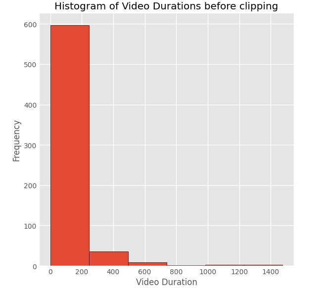
   
We now try to clip the videos with longer duration. For each video file, our script loads the video using OpenCV's `cv2.VideoCapture()` function and retrieves important video properties such as frames per second (fps), frame count, width, height, and video duration. If the video duration is greater than or equal to 60 seconds, the script calculates the middle frame of the video and defines a range of frames centered around the middle frame. In this case, 900 frames (30 seconds at 30 fps) are extracted before and after the middle frame. We extract the clipped videos and save them. The below plot, shows a histogram of video durations after clipping. Now all videos are lesser than 60s.
   
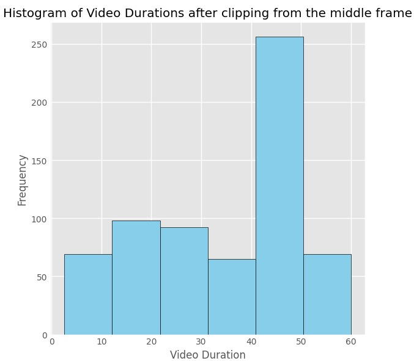
   
Now, we try to increase the frame rate of each video by interpolating frames to achieve a target frame rate of 30 FPS. The script calculates the number of interpolated frames needed to achieve the desired output frame rate of 30 FPS. It then iterates through each frame of the video, interpolating frames between the current and previous frames using linear interpolation `cv2.addWeighted()`. The number of interpolated frames is determined by the ratio between the output frame rate and the original frame rate. The below plot shows the comparison between the FPS of the original and transformed videos. 

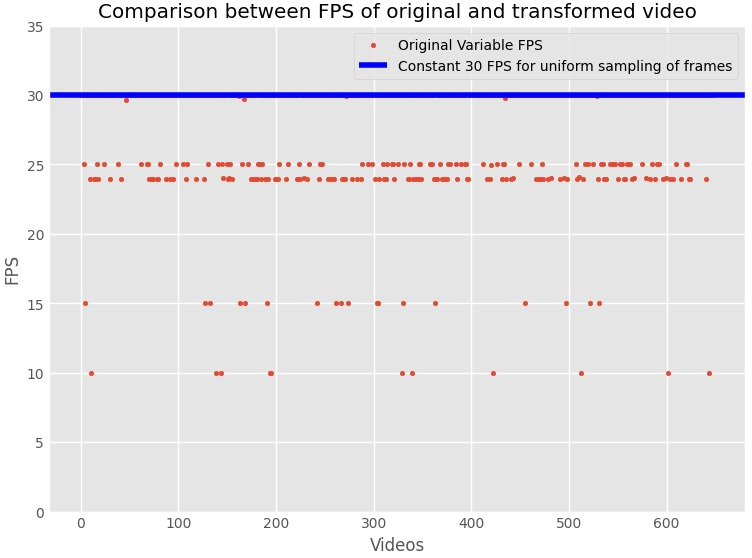
   
The pre-processing methods done for the image franes obtained from the video is given below.   
 
1. **Image Loading:**
   - Loading images using `tf.keras.preprocessing.image.load_img`.

2. **Resizing:**
   - Resizing images to a fixed size (224x224 pixels in this case) using `tf.keras.preprocessing.image.img_to_array` and `resize`.

3. **Normalization:**
   - Normalizing pixel values to the range [0, 1] by dividing by 255.0.
   - This ensures that the input features (pixel values) are within a similar scale, which helps in training deep learning models effectively.

4. **Grayscale Conversion:**
   - Converting images to grayscale using the `convert('L')` method of the PIL library.
   - Rescaling pixel values to the range [0, 1] by dividing by 255.0.
   - Grayscale conversion can simplify the image representation by reducing the number of color channels from 3 (RGB) to 1.

5. **Adding Random Noise:**
   - Adding random noise to the image.
   - Random noise is added to the pixel values of the image to make it more robust to variations in input data.
   - The noise factor controls the intensity of the noise added.

Overall, these preprocessing methods help in cleaning and preparing both text and image data for further analysis or modeling tasks.

## ML Algorithms/Models Identified

The following are the Machine Learning Algorithms implemented for Unsupervised Learning:
*  K-Means -  Used for clustering metadata into a predetermined number of clusters by iteratively assigning data points to the nearest centroid and updating cluster centroids until convergence.
*  GMM - Used for probabilistic clustering and density estimation tasks, particularly when dealing with complex data distributions that can be represented as a mixture of Gaussian distributions.
*  Bertopic - A topic modeling technique that leverages BERT embeddings to perform interpretable topic modeling on the metadata. Used to cluster metadata into popular topics with minimal preprocessing.
   

The following are the Machine Learning Algorithms implemented for Supervised Learning:
*  Hierarchical Multi-modal Contextual Attention Network (HMCAN)
   - BERT – To precisely model both the semantic of the word and the linguistic contexts.
   - ResNet-50 – To extract region features of image.
   - Multi-modal Contextual Attention Network - To effectively fuse the textual and visual features, to build the multimodal context information, and to extract high-order complementary information from it.
   - Hierarchical encoding network - To explore the hierarchical semantic information across different layers of ResNet-50 network.
*  Logistic Regression - To predict the probability of a categorical outcome based on one or more predictor variables.
*  Multinomial Naive Bayes - Used for text classification tasks, particularly when dealing with features that represent counts, such as word frequencies in document analysis.
*  Random Forest - Used for constructing multiple decision trees during training and output the mean prediction (regression) of the individual trees.

## Unsupervised and Supervised Learning Methods Identified

The unsupervised Machine Learning Algorithms are used for clustering the metadata corresponding to the video dataset. Unsupervised Machine Learning Algorithms operate without labeled data, focusing on uncovering patterns, structures, or relationships within datasets. They're pivotal for tasks where the objective is to explore and understand the inherent structure of data without prior knowledge or guidance.

K-Means, a widely-used algorithm in unsupervised learning, partitions data into a predetermined number of clusters. It iteratively assigns data points to the nearest centroid and updates cluster centroids until convergence, effectively grouping similar data points together.

Gaussian Mixture Model (GMM) is another prominent unsupervised learning algorithm used for probabilistic clustering and density estimation. GMM assumes that the data is generated from a mixture of several Gaussian distributions. By iteratively adjusting these distributions to fit the data, GMM can identify clusters and estimate the underlying probability distribution of the dataset.

Bertopic is a relatively newer addition to the unsupervised learning toolbox, leveraging BERT (Bidirectional Encoder Representations from Transformers) embeddings for topic modeling. It excels at clustering text data by transforming text into high-dimensional vector representations using BERT embeddings and then employing clustering techniques to group similar documents together based on their semantic content. Bertopic offers interpretability and minimal preprocessing requirements, making it suitable for various natural language processing tasks.
   
For the machine learning algorithms, supervised learning was used to compare both the text and images along with labels to predict the deepfakes were true or false. 

The Supervised learning methodology involves an approach known as the Hierarchical Multi-modal Contextual Attention Network (HMCAN) for fake news detection. This approach is designed to address the limitations of existing methods by jointly modeling multi-modal context information and the hierarchical semantics of text in a unified deep model.

The methodology consists of three key technical innovations. First, the authors utilize ResNet, and BERT, a powerful text-pretrained deep model, to embed the textual content of news. This allows for the extraction of rich features from both visual and textual modalities. Second, a multi-modal contextual attention network is introduced to fuse both inter-modality and intra-modality relationships. This network is designed to capture the complementary information present in multi-modal contexts, thereby enhancing the understanding of multi-modal data. Third, a hierarchical encoding network to capture the rich hierarchical semantics of the multi-modal data was employed. This network is intended to address the challenge of fully utilizing the multi-modal context information and extracting high-order complementary information to improve the performance of deepfake detection. The HMCAN methodology aims to provide a more effective and robust approach to deepfake detection by leveraging multi-modal context information and the hierarchical semantics of text.

In summary, the methodology involves a comprehensive and innovative approach to deepfake detection, integrating advanced deep learning models, multi-modal contextual attention networks, and hierarchical encoding networks to effectively model multi-modal context information and capture rich hierarchical semantics for improved fake news detection.

# Results and Discussion

## Pre-Processing:
We try to first understand how the metadata looks like after pre-processing. Using wordcloud we visualize both normal and deepfake metadata.
   
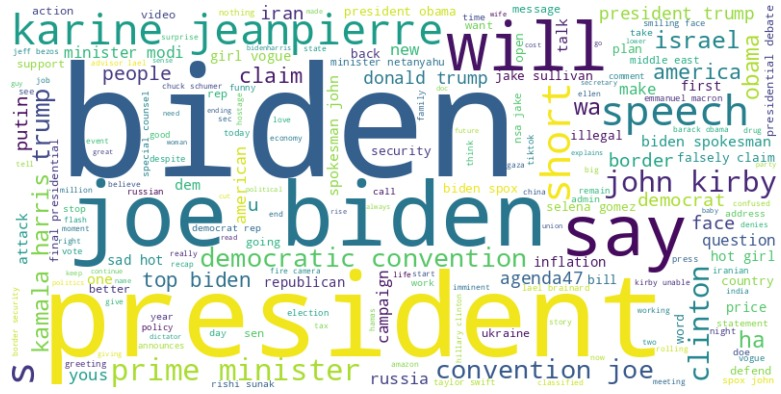

 Wordcloud for normal videos 

 
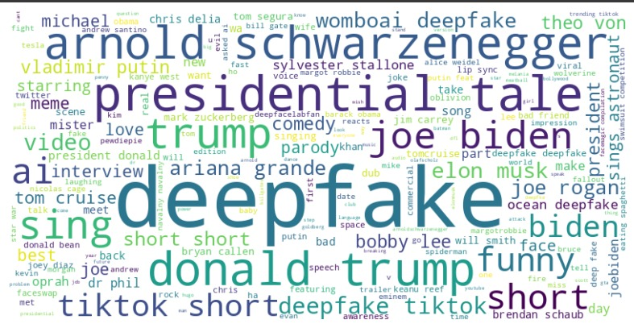

 Wordcloud for deepfake videos 

## Unsupervised Learning Techniques:
We have employed three different unsupervised learning approaches to segregate comments of deepfake videos and normal videos into 20 different clusters.

We have considered using simple Clustering Algorithms to understand how different comments can be classified such that it could be helpful in generating **Artitificial** comments for a video having no comments.
   
All the set of comments for a video are loaded into a pandas dataframe, and this represents a **single document**. This is used to analyze and create TF-IDF vector representation matrix of size 1 x D. This is done for all the videos in the normal dataset and deepfake dataset. The resultant matrix is a N x D matrix, which is provided as an input to the fit function in K-means and GMM.
   
As TF-IDF matrix contains high-dimensional features representing the youtube comments, PCA is applied to visualize these features. Subsection a and b represents the clustering outputs obtained for K-means clustering and GMM having cluster size and number of components as 20 respectively.

### a. K - Means:
   
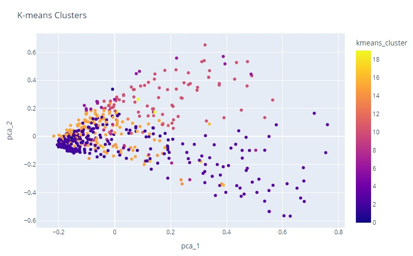

 K-Means for normal videos 

 
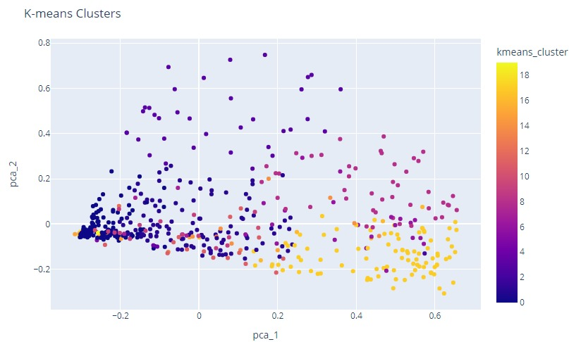

 K-Means for deepfake videos 

   
### b. GMM:
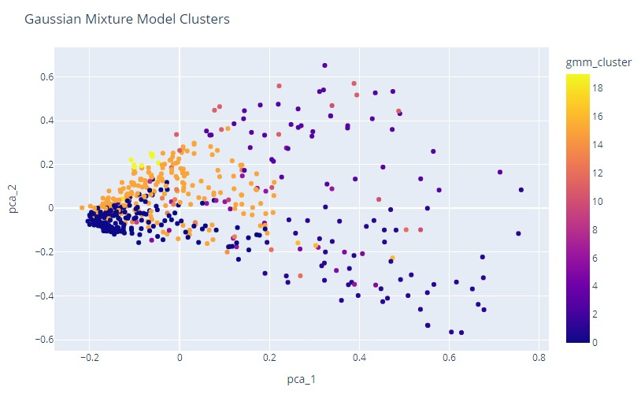

 GMM for normal videos 

 
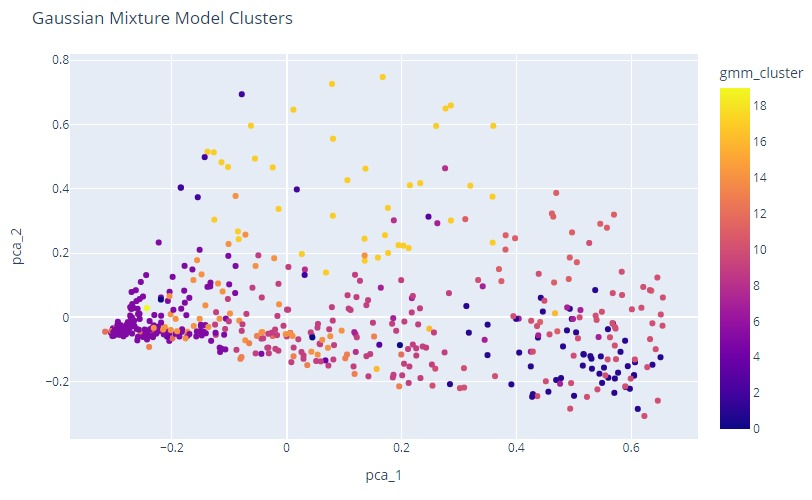

 GMM for deepfake videos 

 
### c. Bertopic (topic-modeling):
The below histogram plot analyses the results obtained after doing topic-modeling on the metadata. A total of 5 topics are obtained, out of which topics 3 and 5 are outliers. Documents here refers to a unit of text data that is being analyzed. A document can represent various types of textual content, such as articles, reviews, tweets, or any other form of text-based data (in this case - comments).
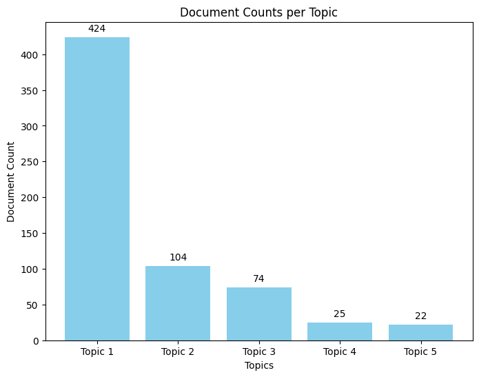

 Bertopic Analysis 

## Supervised Learning Techniques:

### a. HMCAN:
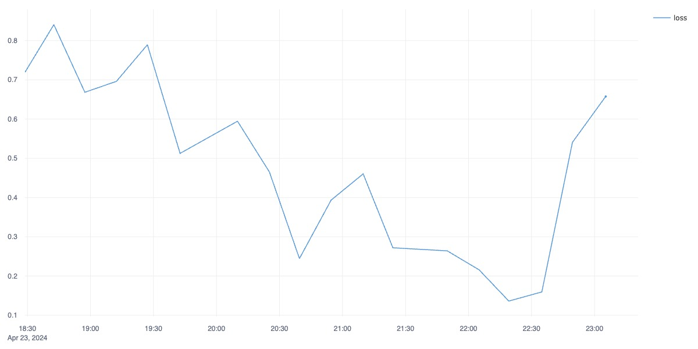

 Loss plot 

   
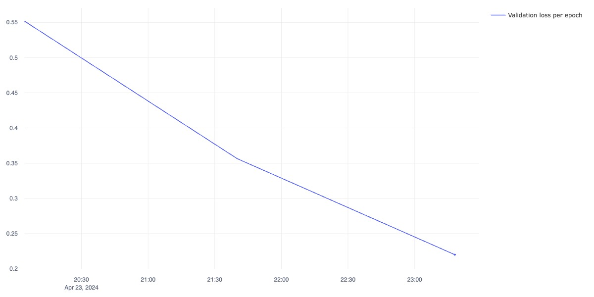

 Validation loss per epoch plot 

   
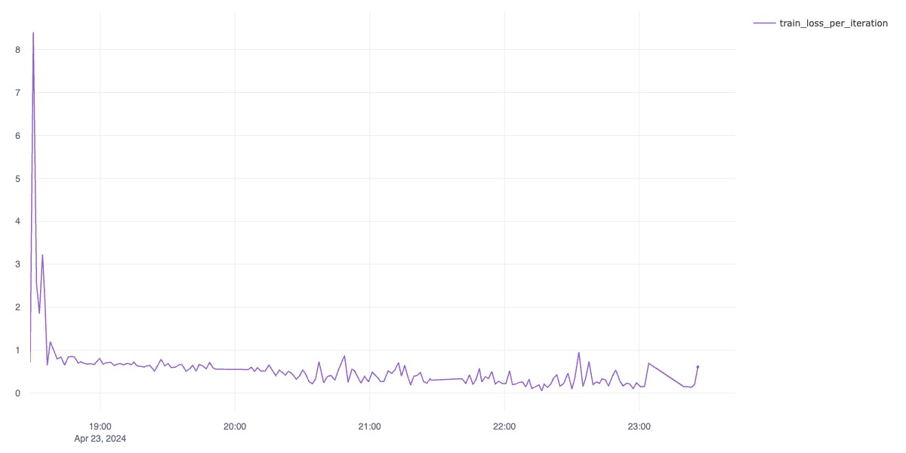

 Train Loss per Iteration 

   
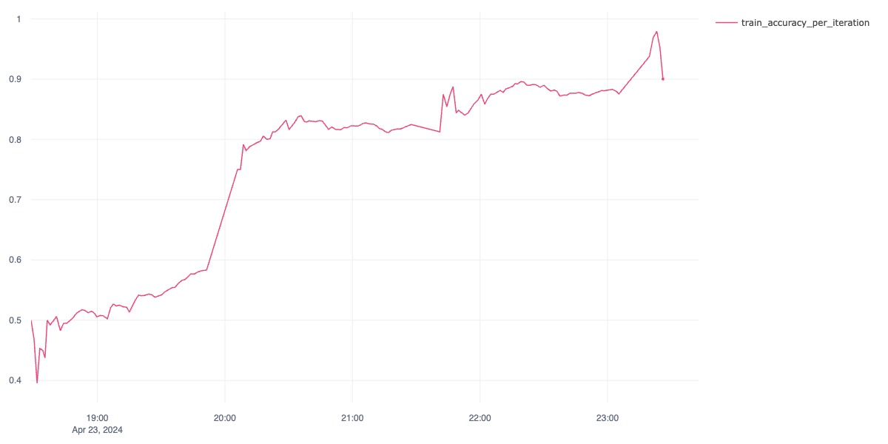

 Train Accuracy per Iteration 

   
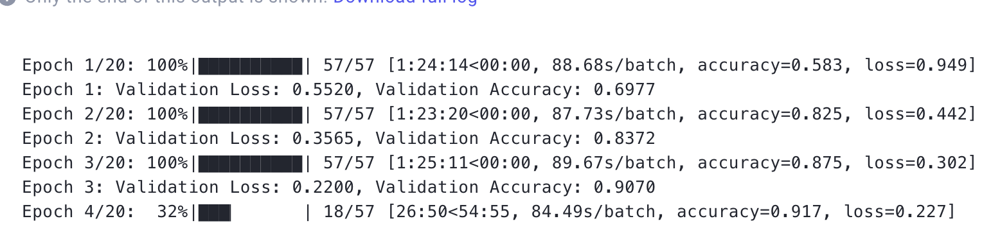

 Snippet of model training (accuracy can be seen increasing) 

   
### b. Logistic Regression:
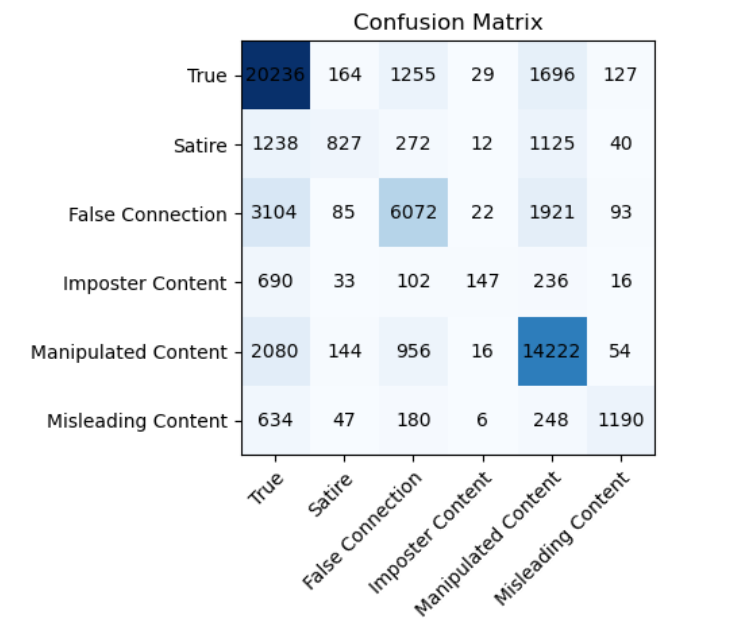

 logistic regression with stemming preprocessing technique 

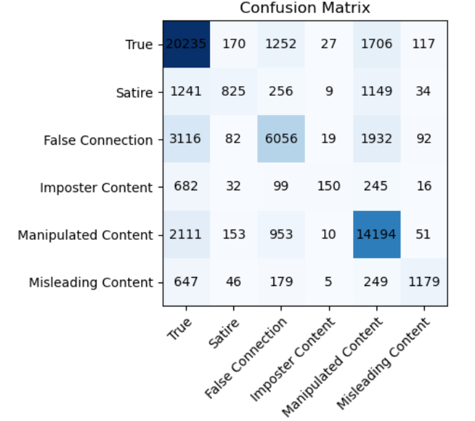

 logistic regression with lemmatization preprocessing technique 
   
   
### c. Multinomial Naive Bayes:
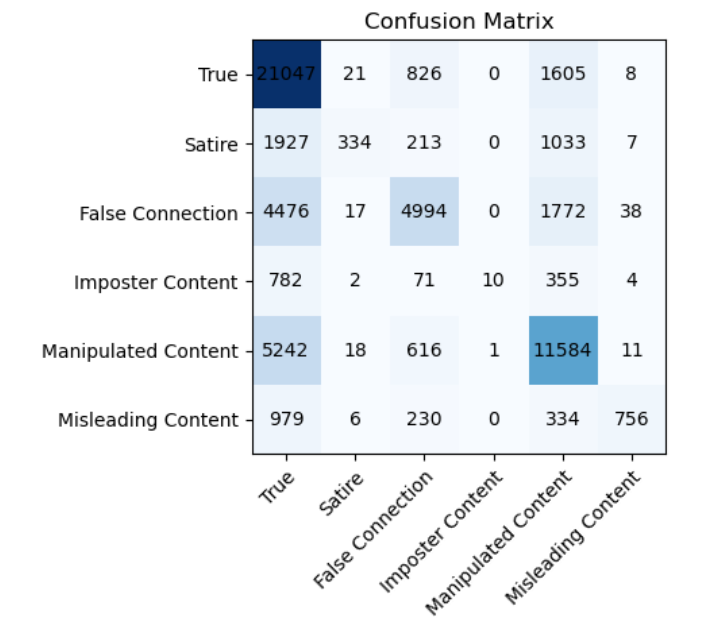

 Multinomial Naive Bayes with stemming preprocessing technique 

   
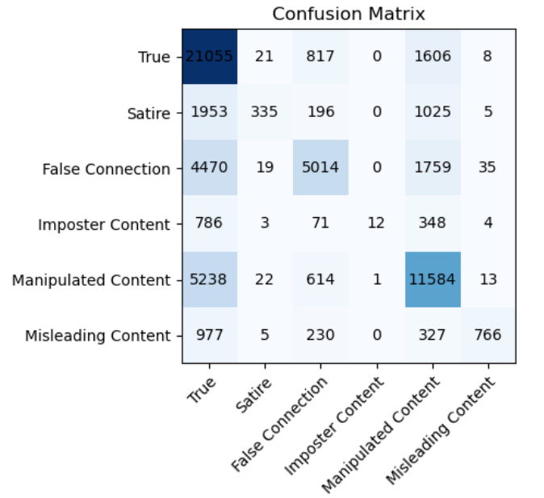

 Multinomial Naive Bayes with lemmatization preprocessing technique 

   
### d. Random Forest:
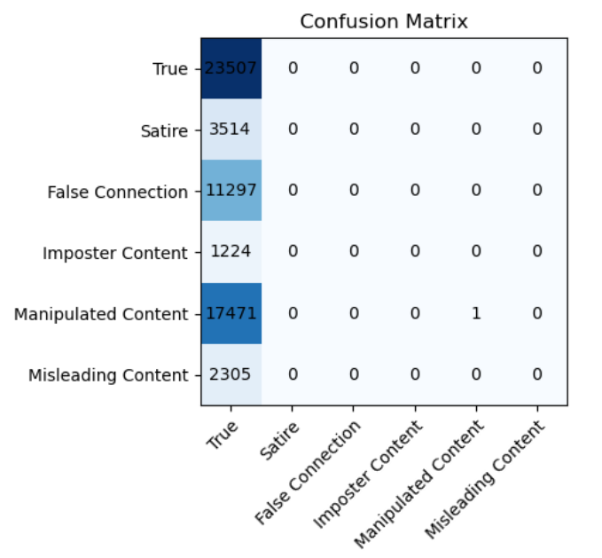

 Random Forest with stemming preprocessing technique 

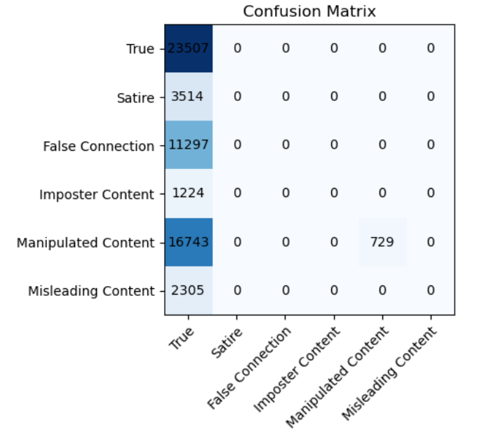

 Random Forest with lemmatization preprocessing technique 

Stemming and lemmatization are both text normalization techniques used in natural language processing (NLP) to reduce words to their base or root form. Stemming is a process of removing suffixes from words to extract their root form, known as the stem. Stemming algorithms apply simple heuristic rules to chop off the ends of words, such as removing common suffixes like "ing", "ed", "s", etc. The resulting stem may not always be a valid word or may not be the actual root form of the word. Lemmatization, on the other hand, is a more sophisticated process that involves accurately reducing words to their base or dictionary form, known as the lemma. Lemmatization considers the morphological analysis of words and applies linguistic rules to transform words into their canonical form. Unlike stemming, lemmatization ensures that the resulting lemma is a valid word and represents the actual root form of the word. Lemmatization typically involves dictionary lookup and part-of-speech tagging to determine the appropriate lemma for a word. Lemmatization algorithms produce higher-quality results compared to stemming but may be computationally more expensive. 
   
From the above plots for stemming and lemmatization it is inferred that lemmatization produces better results. This could be due to the fact that lemmatization produces accurate results by mapping words to their dictionary form, ensuring that the resulting lemma is a valid word. In contrast, stemming may generate stems that are not valid words or are not the actual root form of the word. Lemmatization preserves the context and meaning of words better than stemming. Since lemmatization considers the morphological analysis of words and linguistic rules, it can accurately transform words into their canonical form without losing their semantic meaning.
   
An in-depth analysis for lemmatization and stemming can be found in `ML_Midterm_implementation.ipynb`
   
# References

* * *

1.  Shengsheng Qian, Jinguang Wang, Jun Hu, Quan Fang, and Changsheng Xu. 2021. Hierarchical Multi-modal Contextual Attention Network for Fake News Detection. In Proceedings of the 44th International ACM SIGIR Conference on Research and Development in Information Retrieval (SIGIR ’21), July 11–15, 2021, Virtual Event, Canada. ACM, New York, NY, USA, 10 pages.
2.  Liu, Xuannan, et al. "FakeNewsGPT4: Advancing Multimodal Fake News Detection through Knowledge-Augmented LVLMs." arXiv preprint arXiv:2403.01988 (2024).
3.  Awotunde, J.B.; Jimoh, R.G.; Imoize, A.L.; Abdulrazaq, A.T.; Li, C.-T.; Lee, C.-C. “An Enhanced Deep Learning-Based DeepFake Video Detection and Classification System”, Electronics 2023, 12, 87.
4.  D. Pan, L. Sun, R. Wang, X. Zhang and R. O. Sinnott, “Deepfake Detection through Deep Learning,” 2020 IEEE/ACM International Conference on Big Data Computing, Applications and Technologies (BDCAT)”, pp. 134-143.
5.  A. Haliassos, K. Vougioukas, S. Petridis and M. Pantic, “Lips Don’t Lie: A Generalisable and Robust Approach to Face Forgery Detection,” 2021 IEEE/CVF Conference on Computer Vision and Pattern Recognition (CVPR)”, 2021, pp. 5037-5047.
6.  Gong, L.Y.; Li, X.J. “A Contemporary Survey on Deepfake Detection: Datasets, Algorithms, and Challenges”, Electronics 2024, 13, 585.

# Proposal Link
* * *

[Link for Project Proposal](https://github.gatech.edu/pages/km304/DeepfakeDetectionMidterm/)

# Miscellaneous

* * *

## Gantt Chart

The Gantt Chart for this proposal can be found [here](https://docs.google.com/spreadsheets/d/1blryGG9NpKRAIjEGv3npgYUEHSyCmQ1o/edit?usp=sharing&ouid=109087974927113474034&rtpof=true&sd=true).

## Contribution Table

| Name                         | Midterm Contributions                                        | 
-----------------------|:-----------------------------|:--------------------------------------|
| Charaan Suresh Kumar         | Data Preprocessing, Github Page, Unsupervised Learning       |
| Davendra V Seunarine Maharaj | Data Extraction, Supervised Learning, Training and Inference | 
| Karthikeya Sharma M          | Data Cleaning, Unsupervised Learning, Training and Inference | 
| Kirtaan Srinivasan           | Data Extraction, Data Cleaning, Supervised Learning          |
| Pranaav Jothi Manmohan       | Data Preprocessing, Github Page, Supervised Learning         |
